\newpage

## Question 1

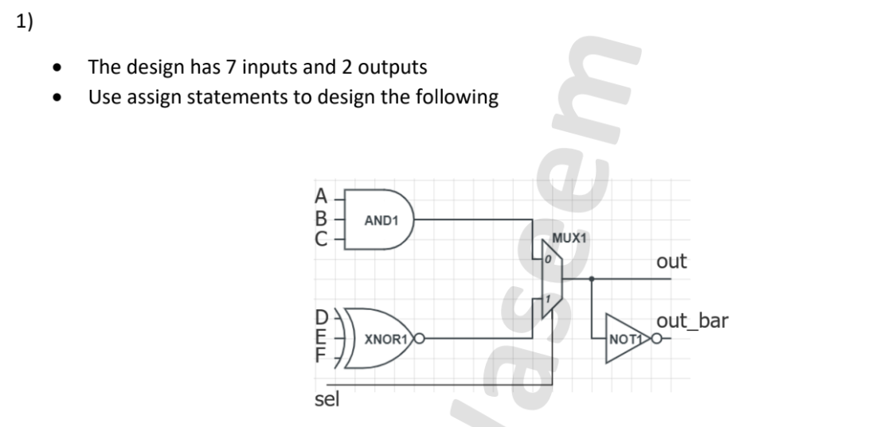{ width=50% }

**Solution:**

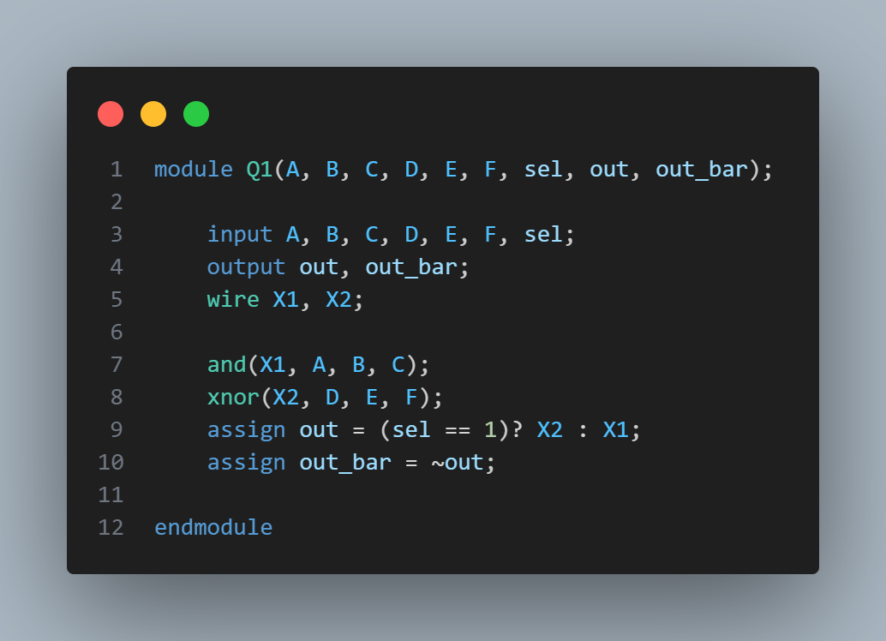{ width=70% }

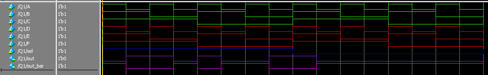{ width=70% }

\newpage

## Question 2

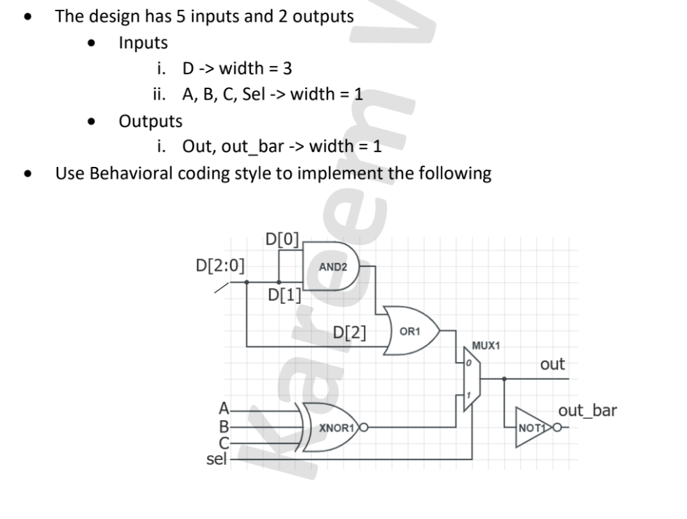{ width=45% }

**Solution:**

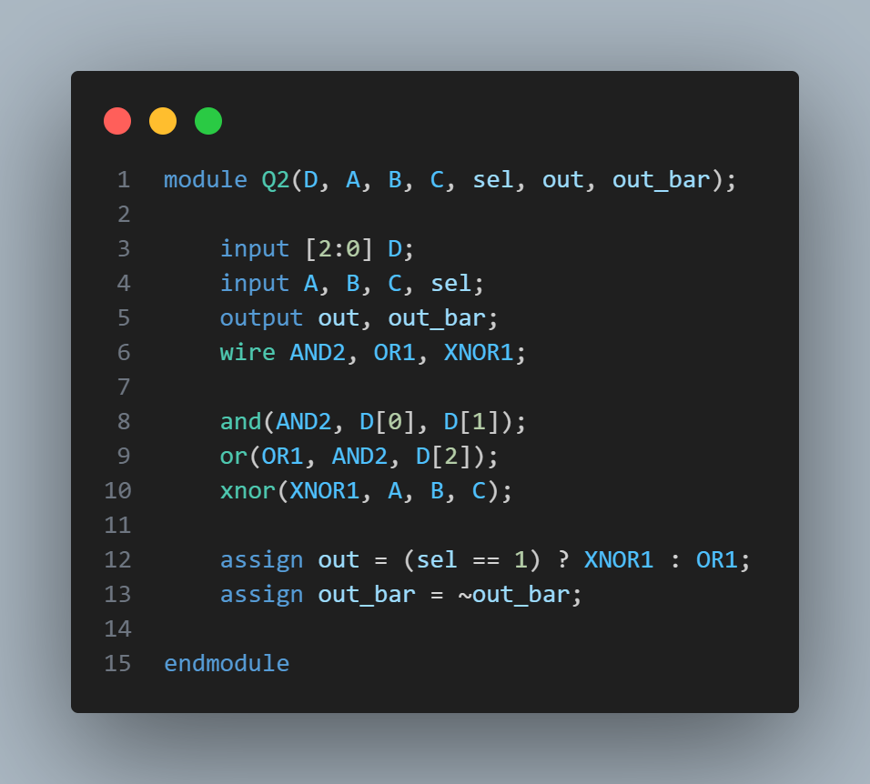{ width=50% }

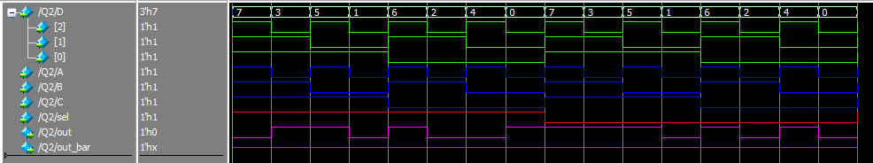{ width=60% }

\newpage

## Question 3

Question: Design a 4-bit adder

**Solution:**

{ width=60% }

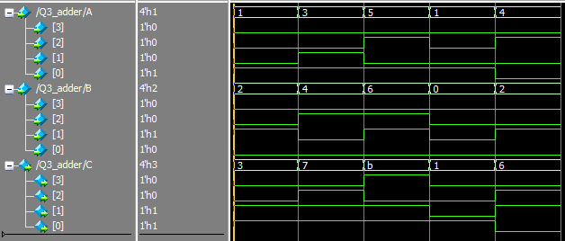{ width=50% }

\newpage

## Question 4

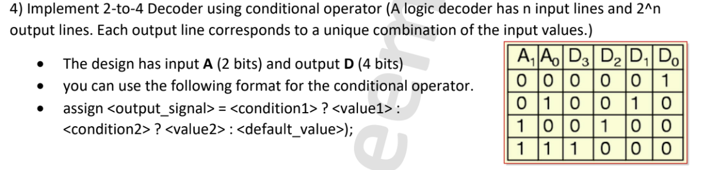{ width=50% }

**Solution:**

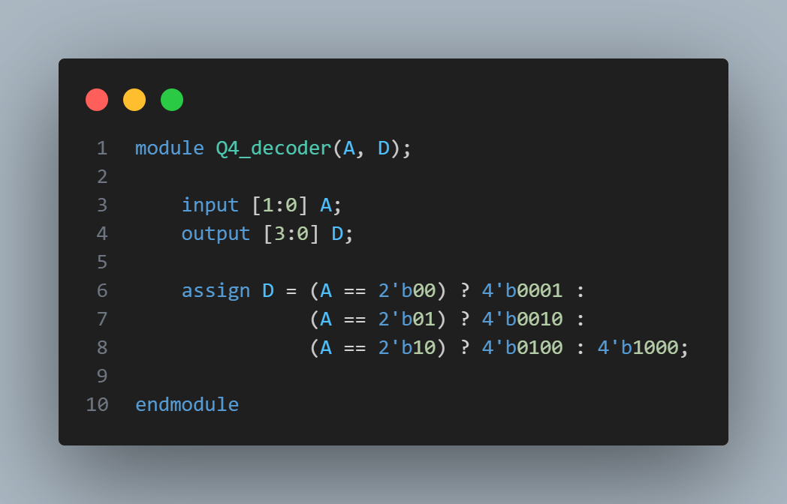{ width=60% }

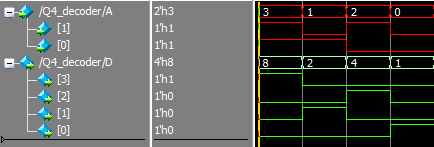{ width=60% }

\newpage

## Question 5

{ width=50% }

**Solution:**

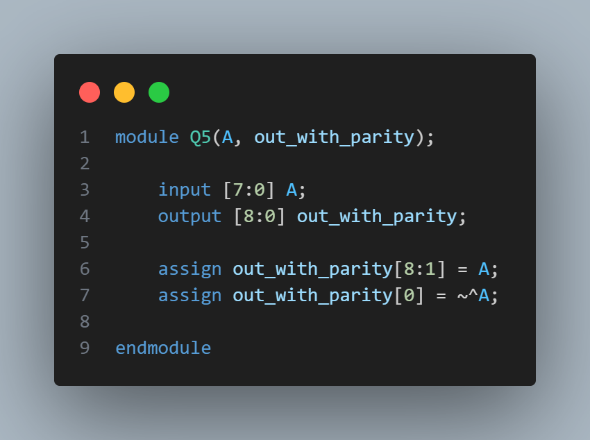{ width=60% }

{ width=60% }
